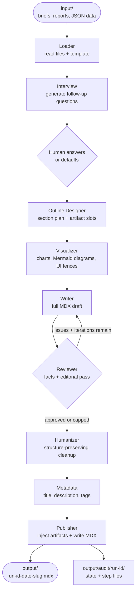
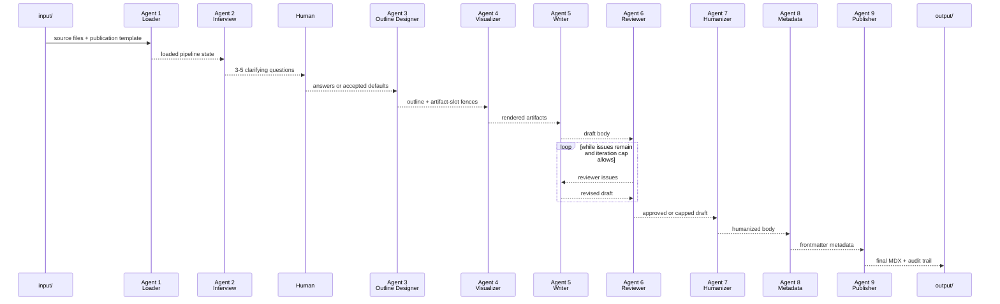
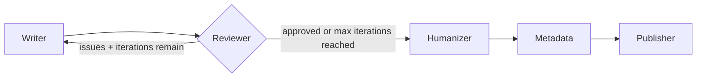

# Pressroom

> *A pressroom is the room where the printing presses run — where a journalist's brief
> becomes the printed word. Here, nine AI agents do the same work: they take a petition
> brief and produce a publication-ready `.mdx` article for
> [albertoduran.com/thejournal](https://albertoduran.com/thejournal).*

A 9-agent LangGraph pipeline that turns source material in `input/` into a finished
`.mdx` publication in `output/`. All agents run locally against an
[Ollama](https://ollama.com) model — no cloud API keys required.

---

## How it works



### Pipeline

The workflow runs in order, with one human interrupt between the interview and outline
designer. The reviewer can send the draft back to the writer until it approves the piece
or reaches `--max-iterations`.



| Node | Agent | What it does |
|---|---|---|
| 1 | **Loader** | Reads all input files and the selected publication template into state |
| 2 | **Interview** | Analyzes the loaded brief and generates 3-5 clarifying questions without rerunning on resume |
| 3 | **Outline Designer** | Collects human answers, then produces a structured section outline with visual artifact slots |
| 4 | **Visualizer** | Fills chart templates deterministically from extracted data; generates Mermaid diagrams and UI components via LLM |
| 5 | **Writer** | Writes the full MDX draft from the outline; re-enters here on reviewer rejection |
| 6 | **Reviewer** | Runs mechanical checks (colons, em dashes, heading counts, word count) and LLM editorial criteria; sends issues back to the writer |
| 7 | **Humanizer** | Strips AI patterns, varies sentence rhythm, and applies voice rules |
| 8 | **Metadata** | Designs frontmatter (title, description, tags) guided by the template |
| 9 | **Publisher** | Injects rendered visuals into placeholder tokens, merges MDX imports, and saves the final `.mdx` file |

### Review loop



---

## Requirements

- Python 3.11+
- [Ollama](https://ollama.com) running locally

---

## Quick start

**1. Clone and install**

```bash
git clone <repo-url>
cd pressroom
python3 -m venv venv
source venv/bin/activate      # Windows: venv\Scripts\activate
pip install -e .
```

**2. Pull a model**

The pipeline works best with a large-context model. `gemma3:27b` is the recommended default.

```bash
ollama pull gemma3:27b
```

**3. Configure environment**

```bash
cp .env.example .env
```

Edit `.env`:

```dotenv
OLLAMA_MODEL=gemma3:27b
OLLAMA_BASE_URL=http://localhost:11434
OLLAMA_TIMEOUT=600
OLLAMA_TEMPERATURE=0.7
```

**4. Add your source files and run**

```bash
# Drop your brief, data files, or reports into input/
python main.py run
```

The pipeline pauses after the interview agent generates its questions. Answer them
(or press Enter to accept the suggested defaults), then wait for the finished file.

---

## Templates

A **publication template** configures the entire pipeline for a specific content type —
its editorial goal, the section structure, which charts to include, and any per-agent
fine-tuning. Two templates are included:

| Template | Use |
|---|---|
| `default` | General-purpose blog post (tutorials, essays, project write-ups) |
| `finance-analysis` | Beginner-friendly stock analysis with preconfigured charts |

```bash
# List available templates
python main.py templates

# Run with a specific template
python main.py run --template finance-analysis
```

When a template has fields with defaults (tone, audience, constraints), they are applied
silently. Pass `--ask` to review and override every default interactively.

See [docs/TEMPLATES.md](docs/TEMPLATES.md) for the full authoring reference — how to
create a new publication template or a new visual template.

---

## Visuals

Charts and callout components are produced from **visual templates** — declarative YAML
recipes in `templates/visuals/`. Code fills the render string with extracted data and
author params; no LLM ever writes an ECharts option object or balances a brace.

The four included templates:

| ID | What it renders |
|---|---|
| `price-line` | Single-series line chart (price history, time series) |
| `category-bar` | Single-series bar chart comparing values across categories |
| `grouped-bar` | Multi-series grouped bars (e.g. Bear / Base / Bull scenarios) |
| `verdict-callout` | Highlighted callout box for a Buy / Hold / Sell verdict |

Visuals are either **preconfigured** in the publication template (the outline places the
fence automatically) or referenced directly on an artifact-slot fence in the outline
for one-off use. Mermaid diagrams and other UI components without a template still use
a freeform LLM path.

---

## Usage

### Add source files to `input/`

Drop any combination of `.md`, `.mdx`, `.txt`, or `.json` files. Subdirectories are
supported. All files are read together as the brief.

```
input/
  report.md           # your article brief or narrative
  data.json           # structured data for charts
  analysis.json       # supplementary analysis
```

> Large JSON files (over ~8 KB) are automatically truncated to their first 8 KB to
> avoid context-window overflow. Include a companion `.md` summary if the full
> dataset matters.

### Run the pipeline

```bash
python main.py run
```

### CLI reference

```
python main.py run [OPTIONS]

Options:
  -i, --input PATH          Source files directory         [default: input/]
  -o, --output PATH         Output directory               [default: output/]
  -t, --template TEXT       Publication template name      [default: default]
  -a, --ask                 Prompt for every config field, even those with defaults
  -m, --max-iterations INT  Max reviewer → writer loops    [default: 3]
      --thread-id TEXT      LangGraph checkpoint thread ID (default: new UUID)
```

**Examples**

```bash
# Stock analysis with preconfigured charts and section structure
python main.py run --template finance-analysis

# See and override every template default before the run starts
python main.py run --template finance-analysis --ask

# Custom source directory, tighter review loop
python main.py run --input path/to/brief --max-iterations 1

# Resume a paused or failed run
python main.py run --thread-id my-thread-123

# List available templates
python main.py templates
```

---

## Project structure

```
pressroom/
├── main.py                     # CLI entry point (Typer + Rich)
├── pyproject.toml
├── AGENTS.md                   # Agent conventions and test coverage map
├── CLAUDE.md                   # Claude Code pointer → AGENTS.md
├── .env.example
│
├── src/
│   ├── config.py               # Reads env vars; resolves directory paths
│   ├── state.py                # LangGraph TypedDict shared by all agents
│   ├── graph.py                # StateGraph definition and review-loop routing
│   ├── llm.py                  # Ollama factory, health check, retry wrapper
│   ├── mdx_document.py         # MDX parse / render utilities
│   ├── docs_loader.py          # Loads context/ and templates/ into prompts
│   ├── template_config.py      # Per-agent fine-tuning helpers
│   ├── json_query.py           # Sandboxed JSON path resolver
│   ├── audit.py                # Run-id allocation and audit-trail writers
│   └── agents/
│       ├── loader.py           # Node 1 — reads input files + template
│       ├── outline.py          # Nodes 2-3 — interview + outline designer
│       ├── visualizer/         # Node 4 — chart templates + freeform visuals
│       │   ├── _databind.py    # Binding grammar parser
│       │   ├── _echart.py      # ECharts template renderer
│       │   ├── _extractor.py   # Data-slot resolver (static + LLM-intent)
│       │   ├── _mermaid.py     # Mermaid generator + sanitizer
│       │   └── _ui.py          # UI component renderer
│       ├── writer.py           # Node 5 — MDX draft writer
│       ├── reviewer.py         # Node 6 — linter + editorial reviewer
│       ├── humanizer.py        # Node 7 — AI-pattern remover
│       ├── humanizer_patterns.py
│       ├── _style.py           # Shared style rules (writer / reviewer / humanizer)
│       ├── metadata.py         # Node 8 — frontmatter designer
│       └── publisher.py        # Node 9 — artifact injector + file writer
│
├── src/visuals/
│   ├── registry.py             # Loads and indexes visual templates
│   └── render.py               # Deterministic token fill (@@data:*@@, @@param:*@@)
│
├── templates/
│   ├── default.yaml            # General-purpose blog post template
│   ├── finance-analysis.yaml   # Stock analysis template with preconfigured charts
│   └── visuals/
│       ├── category-bar.yaml
│       ├── grouped-bar.yaml
│       ├── price-line.yaml
│       └── verdict-callout.yaml
│
├── context/                    # Component and style reference docs (loaded into prompts)
│   ├── visual-components-menu.md
│   ├── MERMAID_AUTHORING.md
│   ├── CALLOUT.md
│   ├── CHAT.md
│   ├── LIST.md
│   ├── MOCKUP_BROWSER.md
│   ├── MOCKUP_PHONE.md
│   ├── MOCKUP_WINDOW.md
│   └── STEPS.md
│
├── docs/
│   └── TEMPLATES.md            # Template authoring guide
│
├── input/                      # Drop source files here before running
├── output/
│   ├── <run-id>-<date>-<slug>.mdx   # finished publication
│   └── audit/
│       └── <run-id>/
│           ├── pipeline_state.json  # full state after every node
│           ├── outline.md           # outline designer output
│           ├── writer.md            # final writer draft (last review round)
│           ├── reviewer.md          # reviewer verdict (last review round)
│           └── humanizer.md        # humanized body
│
└── tests/                      # Unit tests (no Ollama required)
```

---

## Audit trail

Every run is assigned an incrementing numeric id (e.g. `0042`). The id prefixes the
output filename and names a per-run directory under `output/audit/`, so any published
file traces directly back to what each agent delivered.

```
output/
  0042-2026-06-28-salesforce-is-it-a-buy.mdx
  audit/
    0042/
      pipeline_state.json   ← full state snapshot, overwritten after every node
      outline.md            ← what the outline designer produced
      writer.md             ← the final writer draft (last review round)
      reviewer.md           ← the reviewer verdict (last review round)
      humanizer.md          ← the humanized body before publisher
```

To trace a defect in a published file, open `output/audit/<id>/` and read the step
files in order: `outline.md → writer.md → reviewer.md → humanizer.md`. The full
per-round history (all writer ⇄ reviewer iterations) lives in `pipeline_state.json`.

---

## Development

**Run the test suite**

```bash
venv/bin/python -m pytest tests/ -v
```

All tests cover pure helper functions and require no Ollama connection. See
[AGENTS.md](AGENTS.md) for the full coverage map and the rules agents follow when
modifying code.

---

## Troubleshooting

**"Cannot connect to Ollama"**
Start Ollama with `ollama serve` and confirm it is running at `http://localhost:11434`.

**"Model is not available"**
Pull the model first: `ollama pull gemma3:27b` (or whatever `OLLAMA_MODEL` is set to).

**Pipeline finishes but no output file**
Errors are printed at the end of the run and recorded in `output/audit/<id>/pipeline_state.json`
under `"errors"`. The most common cause is the model returning malformed JSON during the
review step — re-running usually resolves it.

**Review loop keeps rejecting the draft**
Increase `--max-iterations` or simplify the source material. The pipeline force-advances
to humanization once the cap is reached regardless of approval status.

**A visual artifact is missing from the output**
A bind failure (data path not found in the input files) degrades silently: the artifact
is skipped and its placeholder is stripped by the publisher. Check `"errors"` in
`output/audit/<id>/pipeline_state.json` for the specific binding that failed.
